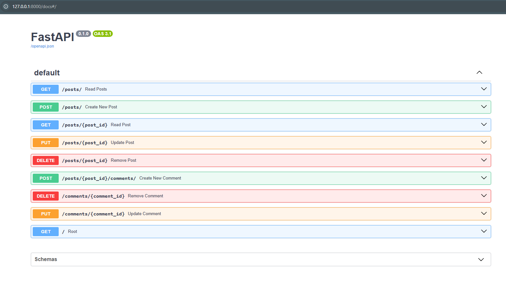

# Posts_and_coments_FastAPI
Project for learning basic CRUD fastAPI

The project implements the main database-based endpoints for reproducing posts and their comments

## Description:
Endpoints:
1. List all Posts endpoint(with filter by comments)
2. Create Post endpoint
3. Read Post detail
4. Update Post endpoint
5. Remove Post endpoint
6. Create Comment endpoint
7. Update Comment endpoint
8. Remove Comment endpoint

Stack:
1. FastAPI (Web framework)
2. SQLAlchemy (ORM)
3. Pydantic (Validation, Serialization)
4. Alembic (Migrations handling)

## How to run:
1. `pip install -r requirements.txt`
2. `alembic upgrade head`
3. `uvicorn main:app --reload`
